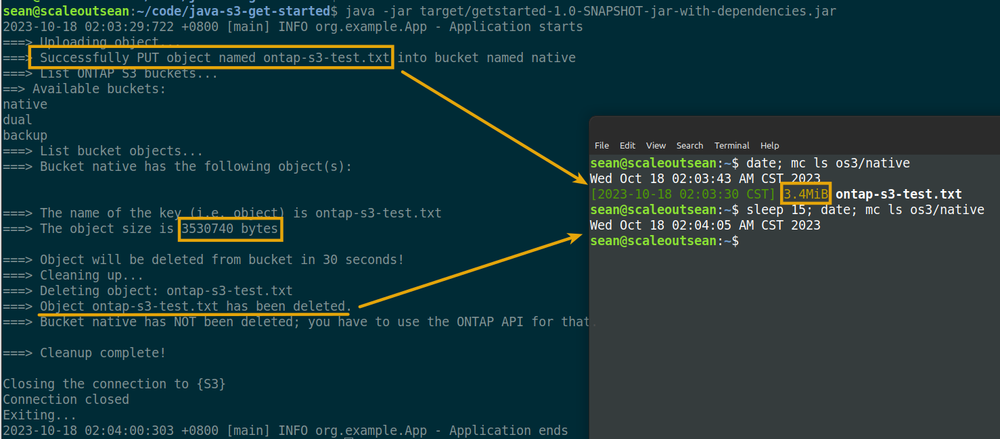

- [S3 Console Demo App](#s3-console-demo-app)
  - [Prerequisites](#prerequisites)
  - [Configure and build](#configure-and-build)
    - [S3 Credentials](#s3-credentials)
    - [S3 bucket, key and file path](#s3-bucket-key-and-file-path)
    - [Build and run](#build-and-run)
  - [Development](#development)
    - [S3 Logging](#s3-logging)
    - [Code structure](#code-structure)
    - [ONTAP API](#ontap-api)
  - [Credits and copyright](#credits-and-copyright)
  - [Screenshot](#screenshot)


# S3 Console Demo App

This project contains a maven application with [AWS Java SDK 2.x](https://github.com/aws/aws-sdk-java-v2) dependencies.

It is based on the official AWS SDK for Java v2. 

This was my first attempt to do something with Java.

## Prerequisites

- Java 1.8+
- Apache Maven
- ONTAP 9.12.1 or higher
- GraalVM Native Image (optional)

## Configure and build 

You need to edit the following files and build from the source.

### S3 Credentials

Set environmental variables. Example for Linux:

```sh
export AWS_ACCESS_KEY_ID="AAAAAAAAAAAAAAAAAAA"
export AWS_SECRET_KEY="BBBBBBBBBBBBBBBBBBBBBBBBBBBBBBBBBBBBB"
export AWS_ENDPOINT_URI="https://192.168.1.52:443"
```

An [older version](https://github.com/scaleoutsean/java-s3-get-started/tree/eb1b21442bb762095f60257c674f4e15209c2190) has these hard-coded, which is convenient, but bad security-wise. 

### S3 bucket, key and file path

Edit `src/main/java/org/example/Handler.java`:

- line 32: bucket name (it must exist on the ONTAP SVM and be accessible to those credentials above)
- line 33: key (object name on S3, please create a random name that will not collide with any other bucket)
- line 34: path to file (or you may leave it as is and just create a file in that location; /tmp/ontap-s3-test.txt)

```java
    public void sendRequest() {
        // String bucket = "native" + System.currentTimeMillis();
        String bucket = "native";
        String key = "ontap-s3-test.txt";
        String objectPath = "/tmp/ontap-s3-test.txt";
```

To test with this README.md, Linux users can do this. 

```sh
cp README.md /tmp/ontap-s3-test.txt 
```

### Build and run

**WARNING**: application automatically **deletes the uploaded object** from the specified bucket (default bucket name: "native"). Other objects - if any - should remain.

Build from repo's root directory and run with `java`:

```sh
mvn clean package
java -jar target/getstarted-1.0-SNAPSHOT-jar-with-dependencies.jar 
```

Output with ONTAP S3 (ONTAP v9.12.1) API endpoint:

```sh
$ java -jar target/getstarted-1.0-SNAPSHOT-jar-with-dependencies.jar 
2023-10-18 01:36:18:641 +0800 [main] INFO org.example.App - Application starts
===> Uploading object...
===> Successfully PUT object named ontap-s3-test.txt into bucket named native
===> List ONTAP S3 buckets...
==> Available buckets:
native
dual
backup
===> List bucket objects...
===> Bucket native has the following object(s):


===> The name of the key (i.e. object) is ontap-s3-test.txt
===> The object size is 3530740 bytes

===> Object will be deleted from bucket in 30 seconds!
===> Cleaning up...
===> Deleting object: ontap-s3-test.txt
===> Object ontap-s3-test.txt has been deleted.
===> Bucket native has NOT been deleted; you have to use the ONTAP API for that.

===> Cleanup complete!

Closing the connection to {S3}
Connection closed
Exiting...
2023-10-18 01:36:49:217 +0800 [main] INFO org.example.App - Application ends

```

## Development

### S3 Logging

Enable debug in `src/main/resources/simplelogger.properties` and rebuild.

Currently log level for S3 is set to "info".

### Code structure

Below is the structure of the generated project.

```
├── src
│   ├── main
│   │   ├── java
│   │   │   └── package
│   │   │       ├── App.java
│   │   │       ├── DependencyFactory.java
│   │   │       └── Handler.java
│   │   └── resources
│   │       └── simplelogger.properties
│   └── test
│       └── java
│           └── package
│               └── HandlerTest.java
```

- `App.java`: main entry of the application
- `DependencyFactory.java`: creates the SDK client
- `Handler.java`: you can invoke the api calls using the SDK client here.

### ONTAP API

Original example (from AWS SDK for Java v2) creates the bucket and deletes it later.

To create and remove a bucket on ONTAP S3 server, we must use the ONTAP API. 

If you're starting from scratch, this may require a number of steps.

- Connect to the cluster API
- Create Storage Virtual Machine
- Create aggregate
- Create S3 service 
- Create users
- Create credentials
- Upload TLS certificate
- etc.

Normally these will be done for you and even buckets should be created by the ONTAP administrator. But if you're given limited administration rights on a subset of resources defined by a Storage Virtual Machine ("SVM"), then you can use the ONTAP API to create and delete buckets, credentials, etc.

For example, to create [S3 bucket](https://library.netapp.com/ecmdocs/ECMLP2884821/html/#/object-store/s3_bucket_create) on ONTAP v9.12.1:

```json
{
  "size": "1677721600",
  "protection_status": {
    "destination": {}
  },
  "constituents_per_aggregate": "4",
  "qos_policy": {
    "max_throughput_iops": "10000",
    "max_throughput_mbps": "500",
    "name": "performance",
    "min_throughput_iops": "2000",
    "min_throughput_mbps": "500",
    "uuid": "1cd8a442-86d1-11e0-ae1c-123478563412"
  },
  "policy": {
    "statements": [
      {
        "sid": "FullAccessToUser1",
        "resources": [
          "bucket1",
          "bucket1/*"
        ],
        "actions": [
          "GetObject",
          "PutObject",
          "DeleteObject",
          "ListBucket"
        ],
        "effect": "allow",
        "conditions": [
          {
            "operator": "ip_address",
            "max_keys": [
              "1000"
            ],
            "delimiters": [
              "/"
            ],
            "source_ips": [
              "1.1.1.1",
              "1.2.2.0/24"
            ],
            "prefixes": [
              "pref"
            ],
            "usernames": [
              "user1"
            ]
          }
        ],
        "principals": [
          "user1",
          "group/grp1"
        ]
      }
    ]
  },
  "nas_path": "/",
  "storage_service_level": "value",
  "aggregates": [
    {
      "name": "aggr1",
      "uuid": "1cd8a442-86d1-11e0-ae1c-123478563412"
    }
  ],
  "audit_event_selector": {
    "access": "all",
    "permission": "all"
  },
  "name": "bucket1",
  "versioning_state": "enabled",
  "allowed": true,
  "comment": "S3 bucket.",
  "type": "s3",
  "svm": {
    "name": "svm1",
    "uuid": "02c9e252-41be-11e9-81d5-00a0986138f7"
  }
}
```

As you can see there are many parameters that go into that call, so it's not totally trivial. 

For other methods and various ONTAP versions, please see [here](https://docs.netapp.com/us-en/ontap-automation/reference/api_reference.html#access-the-ontap-api-documentation-page).

## Credits and copyright

- [AWS Documentation for SDK for Java](https://docs.aws.amazon.com/sdk-for-java/latest/developer-guide/get-started.html)
- AWS code examples are [licensed](https://github.com/awsdocs/aws-doc-sdk-examples) under the Apache 2.0 license
- Changes to the code and this README file are licensed under the same license (Apache 2.0)

## Screenshot


